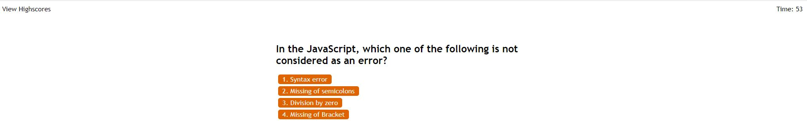
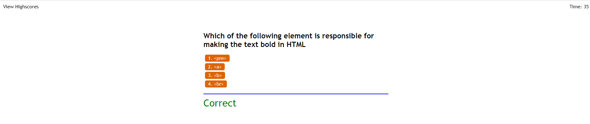
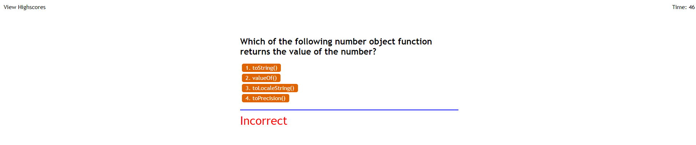

# Code Quiz

## About
This code quiz was designed to test your knowledge on the different aspects of coding. It is a multiple choice quiz and includes questions about HTML, CSS, jQuery, Bootstrap and JavaScript. It will keep track of your local score and you can have multiple attempts to see what highscore you can get!

## Functionality
Upon opening up the [Code Quiz](https://bdjm94.github.io/WebAPI-Code-Quiz/), you are greeted with a welcome message about the code quiz. Upon reading the message, you will learn that you have to answer the questions as fast as you can, but as accurate as each incorrect answer results in a time/score penalty. The quiz starts by hitting the "Start Quiz" button and upon completion, you are able to view your highscores by clicking the "View Highscores" link in the top left corner. There is a timer that keeps track of how long left in the quiz you have, but also will be an indication of your score.

## Code Quiz in Use
Main page of the quiz showing the intro message as well as the "View Highscores" button in the top left and timer in the top right

A snippet of how the Multiple Choice Questions are laid out as well as the text that appears if you get the answer correct or incorrect

End of the quiz showing you your score and telling you to enter your initials to submit the score to the highscores page

Picture of the highscores page showing you the current highscores and who they belong to. Also has the option to go back to the home page of the quiz or to clear all the highscores from the highscores page

## Code Quiz in Action
Here is a gif on the full funcitonality of the code quiz. Shows the timer decreasing for every incorrect answer. Also shows the functionality of the clear highscores button.
